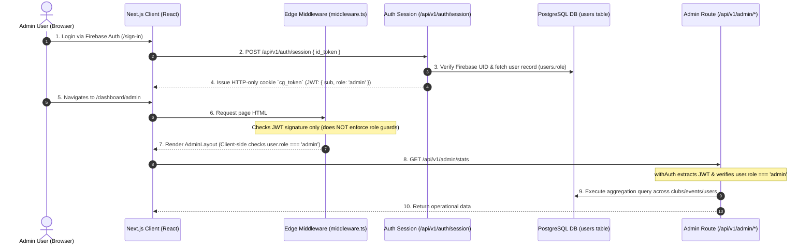

# CampusGrid Admin Authorization & Navigation Architecture Audit

**Document Date:** August 16, 2026  
**Audit Target:** Authorization architecture, Admin Console implementation, role boundaries, and resource domain navigation.  
**Repository Source of Truth:** PostgreSQL schemas, Next.js route handlers, middleware, services, and frontend pages.

---

## 1. Executive Summary & Core Verdict

| Core Architectural Question | Codebase Reality Today | Intended Architectural Alignment |
| :--- | :--- | :--- |
| **Is Admin a separate entity/table?** | **No.** `admin` is an enum value (`'admin'`) stored in the `role` column of the unified `users` table. | ✅ Correct. Privilege is tied to the single user identity. |
| **Is Admin a separate application?** | **Partially segregated.** An isolated `/dashboard/admin` sub-application was created, duplicating resource views. | ⚠️ Misaligned. Domain capabilities should live inside Resource Domains. |
| **Does Admin use identical auth/session?** | **Yes.** Admin signs in through Firebase and receives the standard `cg_token` JWT payload (`{ sub, role, firebase_uid }`). | ✅ Correct. |
| **Are permissions enforced on backend?** | **Yes for `/api/v1/admin/*`, but severe gaps in `/api/v1/organizer/*`.** | ⚠️ High risk in organizer routes. |
| **Is functionality duplicated?** | **Yes.** Event management & club management exist in both `/dashboard/admin` and domain hubs. | ⚠️ Requires consolidation. |

---

## 2. Current Architecture (End-to-End Auth Trace)

Tracing an authenticated administrator from login to database execution:



### Detailed Trace Points:

1. **Authentication Flow (`app/sign-in/page.jsx` & `lib/services/auth.service.ts`):**
   - Administrators authenticate through the exact same Firebase authentication flow as students.
   - `verifyFirebaseTokenAndUpsertUser` resolves the user by `firebase_uid` or institutional email in the `users` table.

2. **Session / JWT Structure (`lib/jwt.ts`):**
   - The platform issues a single standardized JWT stored in the HTTP-only cookie `cg_token`.
   - **Payload:** `{ sub: string (UUID), role: 'student' | 'club_lead' | 'faculty' | 'admin', firebase_uid: string, iat: number, exp: number }`.
   - Admins receive no special token structure; the role field contains `'admin'`.

3. **User Identity & Database Schema (`lib/db/migrations/001_enums.sql` & `002_core_tables.sql`):**
   - Role is stored in `users.role` with enum `user_role` (`'student'`, `'club_lead'`, `'faculty'`, `'alumni'`, `'admin'`).
   - There is no separate `admins` table.

4. **Frontend State & Navigation (`components/providers/AuthProvider.jsx` & `DashboardNavbar.jsx`):**
   - `useAuth()` fetches session user from `GET /api/v1/auth/session`.
   - `DashboardNavbar.jsx` dynamically injects:
     - `Event Studio` if `user.role === 'admin' || user.role === 'club_lead' || user.role === 'faculty'`.
     - `Admin Console` if `user.role === 'admin'`.

5. **Route Guards & Middleware (`middleware.ts` vs `app/dashboard/admin/layout.jsx`):**
   - `middleware.ts` runs on Edge/Node runtime and only verifies whether `cg_token` has a valid JWT signature for `/dashboard/*`. **It does not perform role checks.**
   - If a student navigates to `/dashboard/admin`, the request reaches the client where `AdminLayout` evaluates `user.role !== 'admin'` and displays an "Admin Privileges Required" block screen.

6. **API Authorization (`lib/middleware/with-auth.ts` & `app/api/v1/admin/*`):**
   - `withAuth` parses `cg_token` / Bearer token, checks role against `allowedRoles`, and attaches verified user payload.
   - All `/api/v1/admin/*` routes reject non-admin requests with `403 Forbidden` (`{"success": false, "error": {"message": "Admin privileges required."}}`).

---

## 3. Admin Console Route & Feature Inventory

The current Admin Console lives under `/dashboard/admin` and provides 5 module routes:

| Feature / Action | Current Route | API Route Used | Database Operation | Admin-Only? | Duplicated Elsewhere? | Status in Code |
| :--- | :--- | :--- | :--- | :--- | :--- | :--- |
| **Platform Metrics Overview** | `/dashboard/admin` | `GET /api/v1/admin/stats` | Aggregated `COUNT` queries across `clubs`, `events`, `users`, `certificates` | **Yes** (Platform level) | **No** | ✅ Real API & DB |
| **Recent Event Submissions** | `/dashboard/admin` | `GET /api/v1/admin/stats` | `SELECT` last 5 events ordered by `created_at` | **Yes** (Global triage) | **Partial** (Overlaps with Event Studio) | ✅ Real API & DB |
| **Club Roster & Lead View** | `/dashboard/admin/clubs` | `GET /api/v1/admin/clubs` | `SELECT` clubs with membership counts and lead username | **No** (Privileged view) | **Yes** (Duplicates `/dashboard/clubs` browsing) | ✅ Real API & DB |
| **Create Campus Club** | `/dashboard/admin/clubs` (Modal) | `POST /api/v1/admin/clubs` | `INSERT INTO clubs`, `INSERT INTO club_memberships`, `UPDATE users.role = 'club_lead'` | **Yes** (Direct creation & lead assignment) | **Partial** (Bypasses student registration `/api/v1/clubs/register`) | ✅ Real API & DB |
| **Edit Club & Reassign Lead** | `/dashboard/admin/clubs` (Modal) | `PATCH /api/v1/admin/clubs/[id]` | `UPDATE clubs`, `UPDATE club_memberships`, `UPDATE users.role` | **Yes** (Admin operational action) | **No** | ✅ Real API & DB |
| **Archive Club** | `/dashboard/admin/clubs` | `DELETE /api/v1/admin/clubs/[id]` | `UPDATE clubs SET deleted_at = now(), is_active = FALSE` | **Yes** | **No** | ✅ Real API & DB |
| **Global Events Operations** | `/dashboard/admin/events` | `GET /api/v1/admin/events` | `SELECT` all events across all hosts with registration count | **No** (Privileged view) | **Yes** (Duplicates `/dashboard/events` & `/dashboard/event-studio`) | ✅ Real API & DB |
| **Event Lifecycle Transitions** | `/dashboard/admin/events` | `PATCH /api/v1/admin/events/[id]` | `UPDATE events SET status = $1, published_at = ...` | **Yes** (Global override) | **Yes** (Duplicates Event Studio action handlers) | ✅ Real API & DB |
| **Platform Users Roster** | `/dashboard/admin/users` | `GET /api/v1/admin/users` | `SELECT` users joined with profiles and registration counts | **Yes** (Institutional user list) | **No** | ✅ Real API & DB |
| **Assign Platform Role** | `/dashboard/admin/users` | `PATCH /api/v1/admin/users/[id]` | `UPDATE users SET role = $1` | **Yes** (Platform security boundary) | **No** | ✅ Real API & DB |
| **Global Certificates Audit** | `/dashboard/admin/certificates` | `GET /api/v1/admin/certificates` | `SELECT` all issued certificates joined with recipient & event | **Yes** (Global audit) | **No** (Event Studio only sees single event) | ✅ Real API & DB |

---

## 4. Analysis of Duplicate Functionality & Canonical Mapping

There is significant duplication between `/dashboard/admin` and the resource domains (`/dashboard/events`, `/dashboard/clubs`, `/dashboard/event-studio`):

### A. Events Domain (`/dashboard/events` vs `/dashboard/event-studio` vs `/dashboard/admin/events`)

- **Current Duplication:**
  - `/dashboard/events`: Student discovery of published upcoming/past events.
  - `/dashboard/event-studio`: Organizer/Club Lead lifecycle management of own events (create, submit, withdraw, check-in, issue certificates, archive).
  - `/dashboard/admin/events`: Table listing *all* events globally with direct buttons to force publish, unpublish, complete, or archive.
- **Canonical Decision:**
  - **Public Discovery (`/dashboard/events`):** Canonical discovery and attendance portal for all users (including admins).
  - **Event Creation & Management (`/dashboard/event-studio`):** Canonical operational workspace for creating, editing, check-in, and lifecycle execution.
  - **Admin Global Review / Approval:** Admins should have elevated visibility inside `Event Studio` (or an approval inbox in the Events domain) to review all pending submissions, rather than having a disconnected secondary event management UI.

### B. Clubs Domain (`/dashboard/clubs` vs `/dashboard/admin/clubs`)

- **Current Duplication:**
  - `/dashboard/clubs`: Visual card grid for students discovering clubs and opening `/dashboard/clubs/[id]`. Has no club creation or admin controls.
  - `/dashboard/admin/clubs`: Administrative data table for searching clubs, creating clubs, editing details, assigning club leads, and archiving.
- **Canonical Decision:**
  - **Clubs Hub (`/dashboard/clubs`):** Canonical resource hub. When an Administrator views `/dashboard/clubs`, they should see contextual admin actions (e.g., "+ Create Club", "Pending Club Approvals", "Manage Club" button on club hubs).
  - Club Lead assignment and direct creation belong to the Clubs domain and can be triggered contextually.

---

## 5. Authorization & Security Findings

### Critical Finding: Broken Object-Level Authorization in Organizer Endpoints 🚨

While `/api/v1/admin/*` routes strictly enforce `user.role === 'admin'`, several `/api/v1/organizer/*` endpoints rely only on `withAuth` without verifying event ownership or administrative authority:

1. **`POST /api/v1/organizer/events/[id]/complete`:**
   - **Flaw:** `completeEvent(eventId, user.sub)` is called, but `completeEvent` in `lib/services/event.service.ts` (line 970) does not check if `user.sub` is the event organiser or an admin.
   - **Impact:** Any authenticated student can mark any event on the platform as `completed`.
2. **`POST /api/v1/organizer/events/[id]/archive`:**
   - **Flaw:** `archiveEvent(eventId, user.sub)` does not check ownership or role.
   - **Impact:** Any authenticated student can archive any event.
3. **`POST /api/v1/organizer/events/[id]/certificates`:**
   - **Flaw:** `issueCertificatesForEvent(eventId, user.sub)` does not check ownership.
   - **Impact:** Any authenticated student can trigger certificate generation for completed events.
4. **`POST /api/v1/organizer/events/[id]/applications/decide`:**
   - **Flaw:** `decideApplications` does not verify that `organizerId` owns the event.
   - **Impact:** Any authenticated student can approve/reject event applications for any event.
5. **`POST /api/v1/organizer/events/[id]/announcements`:**
   - **Flaw:** `broadcastAnnouncement` does not check ownership.
   - **Impact:** Any authenticated user can broadcast announcements to attendees of any event.

### Hardcoded Role Checks:

Direct string checks (`user.role === 'admin'`, `'club_lead'`, etc.) are scattered across:
- `components/layout/DashboardNavbar.jsx` (lines 46, 50)
- `app/dashboard/admin/layout.jsx` (line 46)
- `app/dashboard/event-studio/page.jsx` (line 140)
- `lib/services/event.service.ts` (lines 389, 827)
- `app/api/v1/admin/*` route files

---

## 6. Target Product Architecture (Resource Domains vs System Admin)

CampusGrid must be organized around **Resource Domains**, not separate application silos:

```
CampusGrid Platform
├── Resource Domains (Primary Navigation for all users)
│   ├── Dashboard (/dashboard)
│   │   ├── Student: Personal passes, club memberships, campus activity
│   │   ├── Club Lead: Club metrics, upcoming managed events
│   │   └── Admin: Global operational metrics & quick links
│   ├── Events (/dashboard/events)
│   │   ├── Student: Browse, filter, view details, register for passes
│   │   ├── Club Lead: Standard browsing + quick access to manage owned events
│   │   └── Admin: Standard browsing + contextual moderation / review badges
│   ├── Clubs (/dashboard/clubs)
│   │   ├── Student: Discover, join, explore club hubs (/dashboard/clubs/[slug])
│   │   ├── Club Lead: Manage own club page
│   │   └── Admin: Contextual "+ Create Club", approve registrations, assign leads, edit/archive
│   └── Event Studio (/dashboard/event-studio)
│       ├── Student: Hidden (or promotional callout to start a club)
│       ├── Club Lead: Create & manage events for assigned club(s)
│       └── Admin: Global authority to manage, audit, and oversee all events
│
└── System Administration (Dedicated Admin Console: /dashboard/admin)
    ├── Purpose: Strictly system-level governance and cross-cutting controls
    ├── User Management & RBAC Role Assignment (/dashboard/admin/users)
    ├── Global Credential & Certificate Verification Audit (/dashboard/admin/certificates)
    ├── Security & Audit Logs (Future)
    └── Institutional System Configuration (Future)
```

### Role Matrix in Target Architecture:

| Domain / Resource | Student | Club Lead | Admin | Faculty (Future) |
| :--- | :--- | :--- | :--- | :--- |
| **Events (`/dashboard/events`)** | Browse & Register | Browse & Register | Browse & Moderation Controls | Browse & Academic Review |
| **Clubs (`/dashboard/clubs`)** | Discover & Join | Manage Own Club Hub | Create Club, Assign Leads, Manage Any Club | Faculty Advisory Oversight |
| **Event Studio (`/dashboard/event-studio`)** | No Access | Manage Owned Club Events | Full Access across all Events | Review Assigned Club Events |
| **Admin Console (`/dashboard/admin`)** | No Access | No Access | User Management, Role Assignment, Global Audit | No Access |

---

## 7. Migration Plan (Safe, Incremental Steps)

To transition safely to the target architecture without regressions or downtime:

### Step 1: Secure Backend Authorization (Critical Security Fix)
- Implement centralized object-level ownership guards in `lib/services/event.service.ts`:
  - `requireEventOwnershipOrAdmin(eventId, userId, userRole)`
  - `requireClubLeadOrAdmin(clubId, userId, userRole)`
- Apply these guards to `completeEvent`, `archiveEvent`, `issueCertificatesForEvent`, `decideApplications`, and `broadcastAnnouncement`.

### Step 2: Unify Clubs Management into `/dashboard/clubs`
- Add admin-privileged controls directly to `/dashboard/clubs` and `/dashboard/clubs/[slug]`:
  - "+ Create Club" button visible to Admins on `/dashboard/clubs`.
  - "Edit Club" and "Assign Lead" controls on the club page for Admins.
- Ensure the underlying API remains `POST /api/v1/admin/clubs` or `PATCH /api/v1/admin/clubs/[id]`.

### Step 3: Unify Event Operations into `Event Studio` & `/dashboard/events`
- Enhance `Event Studio` (`/dashboard/event-studio`) so Admins have a global toggle ("My Events" vs "All Campus Events").
- Remove duplicate event status toggle tables from `/dashboard/admin/events` once Event Studio handles all global events.

### Step 4: Streamline Admin Console to System-Level Functions
- Scope `/dashboard/admin` navigation strictly to:
  1. **User Management & Role Assignment** (`/dashboard/admin/users`)
  2. **Certificate & Credential Audit** (`/dashboard/admin/certificates`)
  3. **System Overview & Health** (`/dashboard/admin`)
- Remove duplicate club/event CRUD pages from the Admin Console sub-navbar once they live natively in the resource domains.

---

## 8. Explicit List of Things NOT to Change

During any future implementation, the following constraints must be respected:

1. **Do NOT create separate database tables for Admin or Faculty.** Roles must remain on the unified `users` table.
2. **Do NOT implement Faculty workflows now.** Faculty approval is marked as FUTURE.
3. **Do NOT delete the Admin Console.** Retain `/dashboard/admin` for user management, role assignment, and system governance.
4. **Do NOT introduce gamification/XP/leaderboard mechanics** or personality quiz systems.
5. **Do NOT alter existing PostgreSQL database schemas or migrations** without explicit requirement.
6. **Do NOT create mock APIs or mock data.** All services must connect to PostgreSQL.
